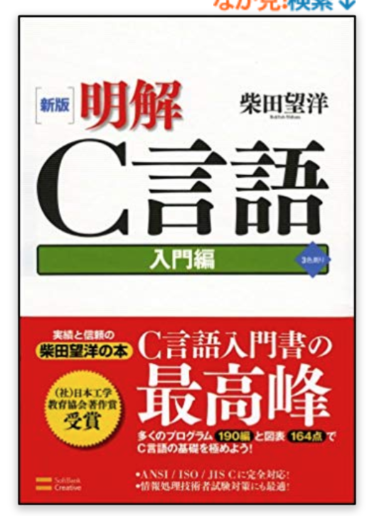

# 1-1 Cプログラミング基本のキ

とは言っても僕(古田)もよく分かってない
マイクロマウスに必要な機能を実装する程度のC言語は必要、、、

---

#参考図書

[amazonリンク](amazon.co.jp/新版-明解C言語-入門編-柴田望洋/dp/4797327928/ref=sr_1_20?__mk_ja_JP=カタカナ&keywords=明解C言語&qid=1576245256&sr=8-20)

#test 1

---
#test 1

---
#test 1
